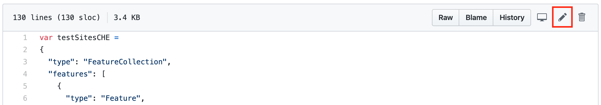

# Contributing to the COVID-19 Testing Facilities Map

| Version | Date       | Author       |
| ------- | ---------- | ------------ |
| 1.0     | 03.04.2020 | Ineffablekod |

First and foremost, thank you for your interest in this project. 

I want to encourage _everyone_ to contribute to this mapping effort. There is almost no data available, even less canonical data. 

In case you are new to GitHub or the open-source space at all, contributing might seem a little scary at first. Don't hesitate! The reason we use great tools like GitHub is to ensure that you can participate without doing any harm. Just follow this [great tutorial](https://github.com/firstcontributions/first-contributions). 

If you have any questions regarding the content of that file, feel free to contact me on Keybase.

## How To Contribute To:

### Testing Facilities

If you want to add a testing facility directly to the repository, you can either do this with a pull request (recommended), or you can do this by clicking "edit" at the top of the file (see screenshot below). 



Please make sure to pay attention to the GeoJSON format of the file. The best way to go about this is to copy the whole code block (either in the forked repository or you can copy it from below). 
You must enter the coordinates in the right order (otherwise, your marker that is supposed to be in the US lands in the Arctic, for example :grimacing:) The correct order is (longitude, latitude)! 

```JSON
{
      "type": "Feature",
      "properties": {
        "name": "UKBB",
        "address": "Spitalstrasse 33, 4056 Basel, Switzerland",
        "contact": "+41 61 704 12 12",
        "web": "https://www.ukbb.ch/",
        "comment": "Only kids younger than 16 are tested"
      },
      "geometry": {
        "type": "Point",
        "coordinates": [
          7.581703662872314,
          47.56356134342556
        ]
      }
    },
```

Do not remove the "comma" at the end of the block; otherwise the next block won't work. 

### Map Functions

TBD

### Map Layers

TBD

### Languages

For now, I think the effort should go into mapping and data gathering. In case there is a strong demand for another language, we will think about how this should be done the best way possible. 