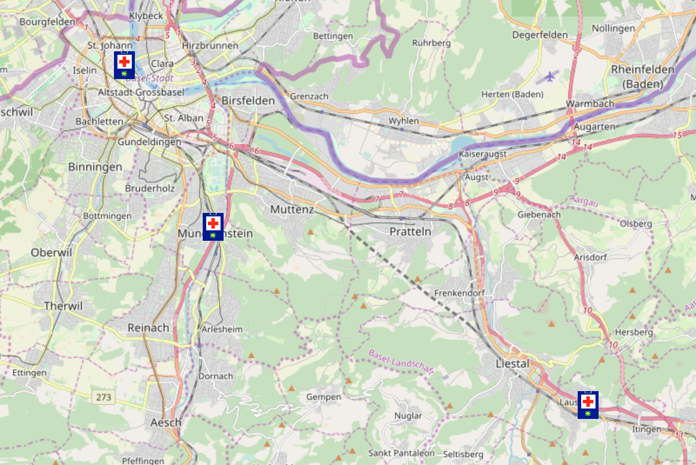

# CEVEN.hack Contribution to #CodevsCOVID19 Hackathon

## A COVID-19 Testing Facilities Map

| Project name        | Cov10TestMap                                                 |
| :------------------ | ------------------------------------------------------------ |
| Title               | A COVID-19 Testing Facilities Map                            |
| Devpost link        | https://devpost.com/software/cov19testmap/                   |
| GitHub link         | https://github.com/IneffableKoD/cov19testmap                 |
| Product demo        | http://ineff.ch/cov19testmap/                                |
| Subject area        | 0020_Corona test processes/ diagnosis                        |
| Beneficiary         | #CodevsCOVID19 Hackathon                                     |
| Team members        | IneffableKoD aka FY Zehnder                                  |
| Dissemination level | Public                                                       |
| Submission          | Monday, 30.03.2020, 17.00                                    |
| Version             | 0.2                                                          |
| Text license        | This work is licensed under a Creative Commons Attribution-ShareAlike 4.0 International License |
| Software license    | MIT License                                                  |
| Status              | Work in progres                                              |

## Short description

There is no map displaying the facilites that offer COVID-19 tests. COVID-19 Testing Facilities Map is an attempt to create a map where those facilities can be mapped. The map serves two puproses:

1. Information for consumers
2. Planning tool for establishing new facilities

## Team 

CEVEN.hack is a hackathon team by CEVEN Decentralized GeoTech. 

## Story

COVID-19 test are hard to run. There is a lack of test-sets and a lack of organization. The flow of those that are supposed to get tested is hard to organize, congestion of people waiting to be tested can lead to unnecessary exposure/risk of infection.

A map displaying the testing facilities helps to plan and organize the testing facilities. 

## Design / Development

The COVID-19 Testing Facilities Map uses Leaflet with OSM tiles. Everything is built on open-source, easily available and easy to manipulate software/code.

## Whats Next?

- Find capable collaborators
- Enter more data on testing facilities
- See "TO-DO"

## Credits

Thanks and shoutouts to:

- TomazicM (https://gis.stackexchange.com/users/104146/tomazicm) 
- Malcolm Maclean (https://leanpub.com/u/d3noob)
- The Leaflet team
- The OSM community

------

## TO-DO

| Status | Task                            | Who   |
| ------ | ------------------------------- | ----- |
| 0      | Update README.md                |       |
| 0      | Make website in popup hyperlink |       |
| 0      | Add layer "unverified"          |       |
| 0      | Add layer selection on map      |       |
| 1      | Add Credits                     | Ineff |
| 0      | Add all Swiss facilities        |       |
| 0      | Add other facilities            |       |

## Resources 

Custom Leaflet L.Control control https://jsfiddle.net/TomazicM/rqu3nvLj/

------

